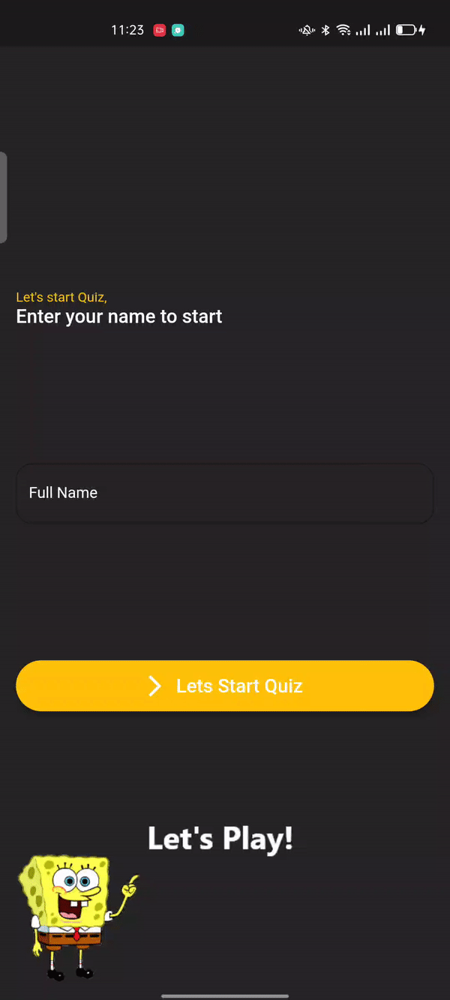

# Quiz App ✍🏻
Quiz App TimeController&GetX [MVC pattern] 👨🏻‍💻

Quiz app is open-source Quiz app for Android & ios. It is built with Dart on top of Google's Flutter Framework.

<b>Quiz App</b>

<b>Quiz App</b>

## Snapshots

| Welcom Screen
|------
|

| Question One Page | Question Two Dialog|
|------|-------|
|||

| Score Screen
|------
|

